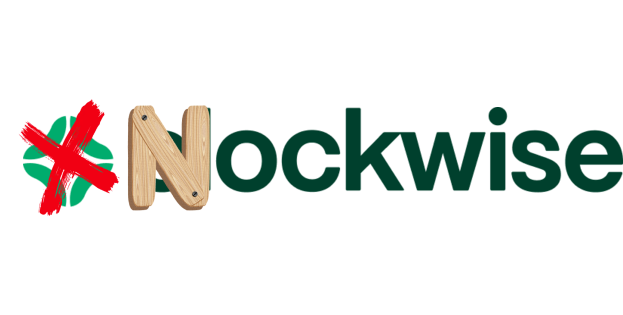
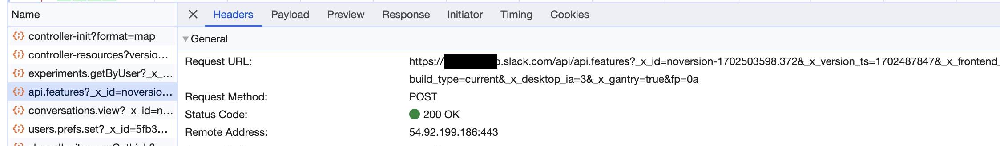
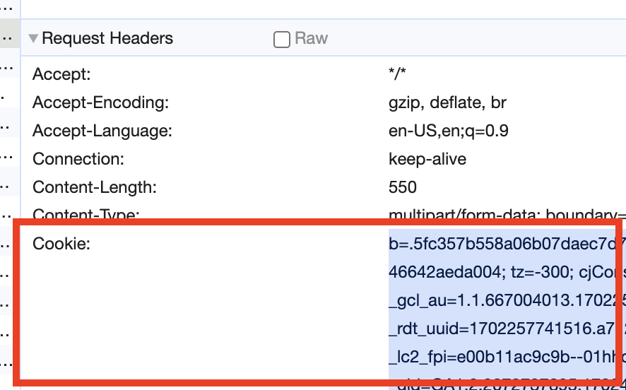
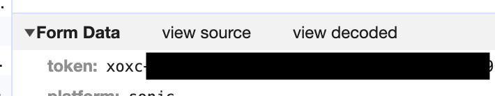

<p align="center">
  
</p>

# Nockwise

A lightweight [Clockwise](https://www.getclockwise.com/home) alternative, built
& deployed with [Deno](https://deno.com/) using
[Deno crons](https://deno.com/blog/cron).

> [!WARNING]
> Knockwise is a **very hacky** utility and **not recommended** for other usages
> other than experimental ones. Be mindful before setting it up and
> tying it up to you account, as the consequences or ban risks from Slack are
> still unclear.

## Why a Clockwise knock-off?

Nockwise allows you to get the basic Clockwise features without having to create
a Slack App and get through the approval process of your workspace organization.
Simply as that.

## Getting started

Before gettings started, you'll need some elements:

- Your Slack workspace API url (should be something like
  `<your-organization-name>.enterprise.slack.com/api`)
- Your Slack session cookie (we'll hijack this on the following section).
- Your Slack session token (same as above).

### Pre-requisite: Hijacking Slack's web session

In order to bypass Slack's requirement to create an app in order to interact
with the SDK, we'll extract our session information from Slack's web
application. This assumes you're already logged in the Slack workspace you want
Nockwise to act in.

After opening the opening the workspace, you'll want to open Chrome's Developer
Tools, and navigate into the "Network" tab. After that, hit `Cmd+R` to reload
the page and start capturing network requests.

You're interested on finding the **initial API call**, which corresponds with
the `api.features` endpoint.

.

You can even extract the API endpoint of your workspace from that call, by
copying the URL from the "Request URL" field and dropping the query parameters.

After you've found out the API call and the workspace API URL, scroll down until
you get to the "Request Headers" section, and search for the "Cookie" header:

.

Select the value and copy it somewhere, that's your session cookie right there,
and it's necessary for Nockwise to perform the initial API authentication.

Finally, switch to the "Payload" tab, and scroll down until you see the
request's "Form Data" section. Expand that submenu, and copy the "token" field.

.

That token will authenticate against the procedure calls we perform, we now have
all of the basic requirements to configure Nockwise properly.

### Cloning & setting up local environment

After you've gathered everything, clone the repo:

```sh
$ git clone https://github.com/gantoreno/portfolio-v4.git
```

Then, rename the `.env.example` file to `.env`, and fill-in the credentials you
gathered before. Make sure to enclose the values with double quotes (").

At this point, you can open `schedule.json` and modify it to match your schedule
and/or work days/hours.

> [!NOTE] Keep in mind that the array must **always** contain 7 objects, `start`
> must **always** be smaller than `end` (both being positive integers between 0
> and 23), and the first & last items are always Sunday, and Saturday,
> accordingly. This is in order to match the general date interpretation (where
> weeks start on Sunday as day `0`, and end with Saturday as day `7`).

### Deploying

After you've configured the project and the environment variables properly, you
can deploy to Deno with `deployctl`:

```sh
$ deployctl deploy --prod --project=<give-it-a-name> src/main.ts
```

It'll ask you to authenticate on the Deno site, so make sure to create an
account there as well. Make sure to keep the `ENABLED` environment flag as
`true`.

Happy hacking! 🎉
